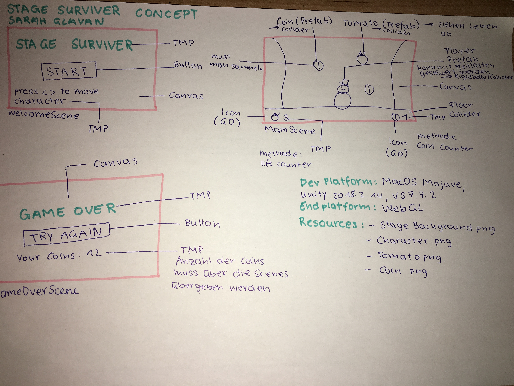
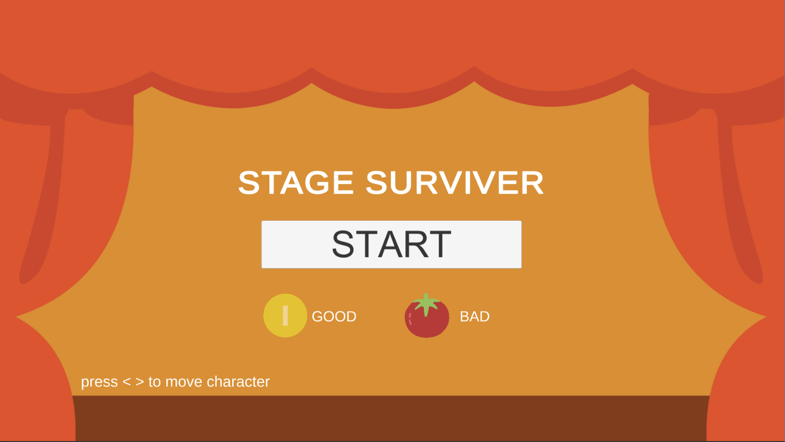
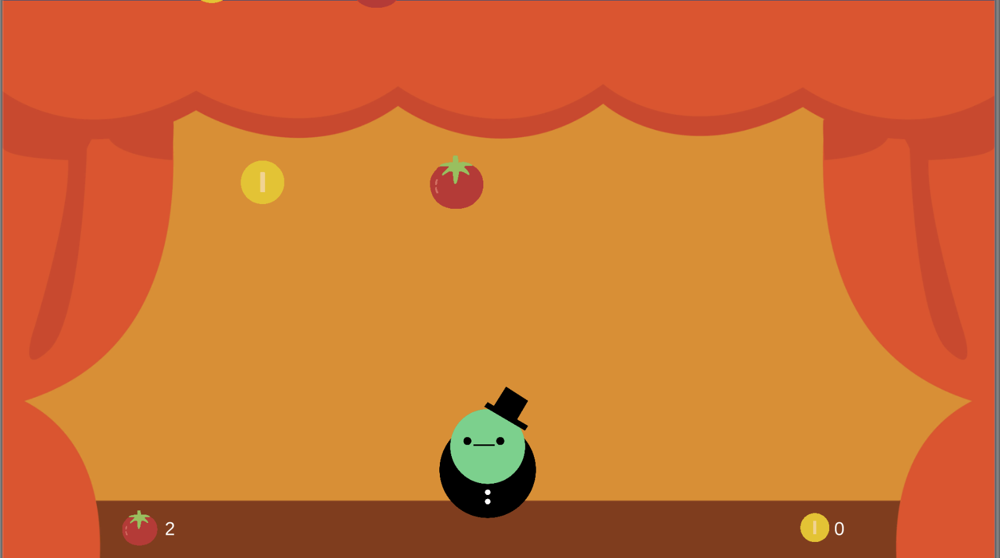

# StageSurviver-sglavan
The game StageSurviver is about a character called Tom on a stage. 
Tom is really trying to impress his audience, but not everyone likes his performance on stage. 
He has to collect coins and to elude tomatoes falling down. 
His goal is surviveing and collecting as many coins as possible.

 + Progress: Game is finished and playable.

 + Status: 100%

 + PLAY THE GAME HERE: https://www.sharemygame.com/share/06f40ff9-2cae-4f88-8234-940e1853417b (upload: 19.02.19 // 30 days online)

 + Development Platform: MacOS Mojave, Unity 2018.2.14, VS 7.7.2, Scripting Runtime Version: .NET 3.5
   Equivalent, API Compatibility Level: .NET 2.0 Subset

 + Target Platform: WebGL (Resolution: 1920*1080)

 + Controles: arrow key left, arrow key right, mouse click (in menu)

 + Resources: Unity Documentation, YouTube

 + Third party material:
https://unity3d.com/de/learn/tutorials/projects/2d-ufo-tutorial/controlling-player
https://www.youtube.com/watch?v=AI8XNNRpTTw

 + Concept:

 + Ingame Screenshots:

 + Limitations, Lessons Learned:
   My limitations were definitely in scripting knowledge. I had to google everything.
   But now I know how to set up a Unity project correctly and how to write code more beautiful. 
   

Copyright by Sarah Glavan, 2019

