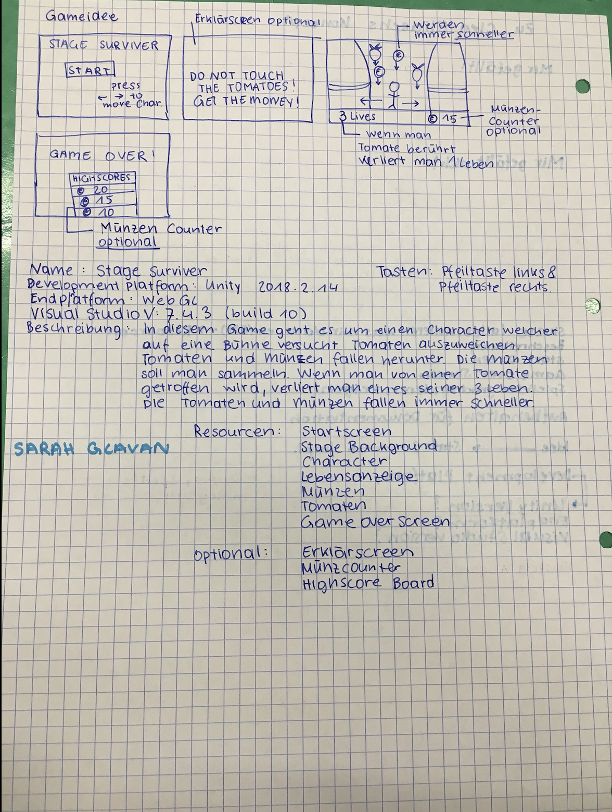

# StageSurviver-sglavan
The game StageSurviver is about a character on a stage. He has to collect coins and to elude tomatoes falling down. The goal is surving as long as possible.

Development Platform: MacOS Mojave, Unity 2018.2.14,VS 7.4.3

Target Platform: WebGL (1920*1080)

Steuerung: Pfeiltaste links, Pfeiltaste rechts, Mausklick (im Menü)

Resources: tomatoe.png, background.png, coin.png, character.png (Copyright Sarah Glavan) 

aktueller Stand: alle pngs implementiert, Skripts angelegt

